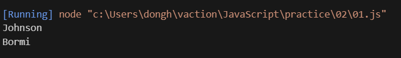
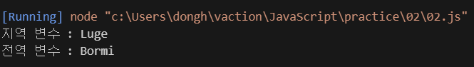

## Welcome to Java Script

### 변수

- 모든 프로그램에서 처음 배우는 것.
- 물건을 담는 상자 같은 개념

```js

// = 는 "왼쪽은 오른쪽이다" 라는 개념
// 수학적의미의 =는 ==로 사용한다. 
let container = 'Bormi';

let currentMoney = '10';
```

`let` : 변수를 사용하겠다는 키워드

`container, currentMoney` : 변수의 이름

`Bormi, 10` : 변수의 값

변수의 이름에는 규칙이 있다.

```js
// 한글은 사용 불가능
let 유튜바 = 'Bormi';

// 첫 글자 영어 금지
let 10Money = '10';

// _ , $ 을 제외한 특수문자 금지
let my!stuff = '10';


// 예약어 사용 금지 ex) let, if
let return = '10';
```

- 전역 변수와 지역 변수

```js
// 모두가 사용가능한 전역 변수.
let name = 'Bormi';

function myFunction(){
    // myFunction()만 사용 가능한 변수
    // 밖에서 사용하려고 하면 접근 못한다
    let name = 'Johnson';
}
```
- 변수 값 보기

```js
// 결과 값 : undefinded. 
console.log(name);

// 결과 값 : Bormi 출력
let name = 'Bormi';
console.log(name);
```


```js
// 모두가 사용가능한 전역 변수.
let name = 'Bormi';

function myFunction(){
    let name = 'Johnson';
    console.log(name);
}

myFunction();
console.log(name);
```



- 지역 변수와 전역 변수 구분 해보기 

```js
let name = 'Bormi';

function myFunction2(){
    let name = 'Luge';
    console.log('지역 변수 : ' + name); // + 연산자로 글자끼리 합칠 수 있음 
}

myFunction2();
console.log('전역 변수 : ' + name);
```



- 예제 문제

```js

let item = '사과';

function pickFruit() {
    let item = '바나나';
    console.log('함수 안: ' + item);
}

pickFruit();
console.log('함수 밖: ' + item);

```

출력
<span style="color: white;">
함수 안: 바나나
함수 밖: 사과
</span>

```js

let user = '보르미';

function outer() {
    let user = '존슨';

    function inner() {
        console.log('내부 함수: ' + user);
    }

    inner();
}

outer();
console.log('전역 영역: ' + user);


```
예상 출력
<span style="color: white;">
    내부 함수: 존슨  
    전역 영역: 보르미
</span>

---

### 데이터 타입

- 데이터 타입은 변수 안에 있는 값의 타입을 나타낸다.
- 종류에 따라 메모리 할당이 다르다.

```js
// 문자열 (String)
let name = 'Bormi';

// 숫자 (Number)
let age = '17';

// 불린 (Boolean) 참, 거짓
let flag = 'true';

// 객체 (Object)
let lists = [1,2,3]; // 배열
let lists2 = {one:1, two:2, three:3}; // Map과 유사 함 
```

- 변수끼리의 연산
    - 숫자는 더한다.
    - 숫자 + 문자열은 숫자를 문자열로 만들어서 더한다.
    - 문자열은 문자를 합친다.
    - 불린은 true : 1, false : 0으로 변환한다.


- 문제 풀이

---

##### 문제 1

```js
console.log(1 + 2);
```
<span style="color: white;">
3
</span>

##### 문제 2

```js
console.log(5 + "개");
```

<span style="color: white;">
"5개" ""-> 문자열로 나온다는 뜻
</span>

##### 문제 3

```js
console.log("Hello" + "World");
```

<span style="color: white;">
"HelloWorld"
</span>

##### 문제 4

```js
console.log(true + 1);
```

<span style="color: white;">
2
</span>


##### 문제 5

```js
console.log(false + "입니다");
```

<span style="color: white;">
"0입니다"
</span>


##### 문제 6

```js
console.log(3 + true + "개");
```

<span style="color: white;">
"4개"
</span>


- 특수 변수
```js
//아무것도 지정 안한 상태.
//undefined
let name;
console.log(name);

//아무것도 없다는 상태가 들어간 상태
//null
let not = null;
console.log(not);
```

- 데이터 타입 확인
    - typeof는 데이터 타입을 확인

```js
console.log('Bormi', typeof 'Bormi'); // Bormi string
console.log('10', typeof 10); // 10 number
```

- 나누기 오류의 경우

```js
console.log(1 / 0); // Infinity
console.log(5  + 'Bormi'); // NaN (Not a Number)

//숫자의 경우 (문자열 숫자도 마찬가지) false 리턴
console.log(isNaN(3)); // false
console.log(isNaN('3')); // false
console.log(isNaN('Bormi')); // true
```


---
## 챕터 문제
```js
let myBox;
let yourBox = null;

console.log(myBox, typeof myBox);
console.log(yourBox, typeof yourBox);

console.log('==', null == undefinded);
console.log('===', null == undefinded);
```
<span style="color: white;">
undefined undefined
null object -> js 유우명한 버그임
== true
=== false

===는 엄격한 비교다 타입이 정확히 일치해야한다.
</span>


```js
let myBox = '';
let yourBox = '    ';

console.log(myBox == yourBox);
console.log(typeof myBox, typeof yourBox);
```
<span style="color: white;">
false
undefined string

yourBox 안에는 공백이 들어가 있다.
</span>