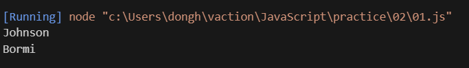

## Welcome to Java Script

### 변수

- 모든 프로그램에서 처음 배우는 것.
- 물건을 담는 상자 같은 개념

```js

// = 는 "왼쪽은 오른쪽이다" 라는 개념
// 수학적의미의 =는 ==로 사용한다. 
let container = 'Bormi';

let currentMoney = '10';
```

`let` : 변수를 사용하겠다는 키워드

`container, currentMoney` : 변수의 이름

`Bormi, 10` : 변수의 값

변수의 이름에는 규칙이 있다.

```js
// 한글은 사용 불가능
let 유튜바 = 'Bormi';

// 첫 글자 영어 금지
let 10Money = '10';

// _ , $ 을 제외한 특수문자 금지
let my!stuff = '10';


// 예약어 사용 금지 ex) let, if
let return = '10';
```

- 전역 변수와 지역 변수

```js
// 모두가 사용가능한 전역 변수.
let name = 'Bormi';

function myFunction(){
    // myFunction()만 사용 가능한 변수
    // 밖에서 사용하려고 하면 접근 못한다
    let name = 'Johnson';
}
```
- 변수 값 보기

```js
// 결과 값 : undefinded. 
console.log(name);

// 결과 값 : Bormi 출력
let name = 'Bormi';
console.log(name);
```


```js
// 모두가 사용가능한 전역 변수.
let name = 'Bormi';

function myFunction(){
    let name = 'Johnson';
    console.log(name);
}

myFunction();
console.log(name);
```


